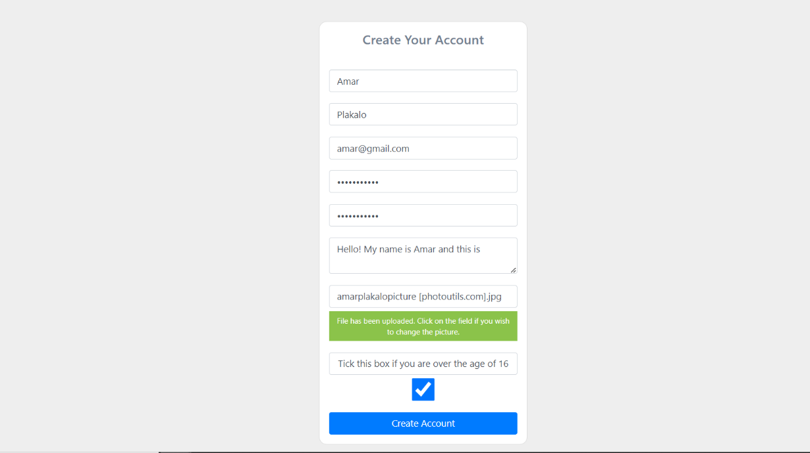

# Online-Discussion-Forum

1. Open the project files
2. In the terminal, type : pip install -r requirements.txt
3. After that, locate the app.py file and click on it.
4. In the terminal below, type : python app.py
5. Wait for it to load. It will take a few moments.
6. It will generate the URL. This is the localhost. Visit the localhost and you can view the website

The first objective was to create a registration system that would allow the student to create an account and store the information from the registration in a MongoDB database. This MongoDB database would store the student information which would then be used to allow the student to login. In the registration part, the student enters their name and surname, their valid email address, a strong password consisting of at least 10 characters, the bio, a profile picture (if they don’t want to upload a profile picture, there is a default one that will be put in place), and they have to tick the box if they are over the age of 16. Once that is completed, they can click on the “Create Account” button.

After registering, the student would automatically be logged in. If the student logged out and wanted to sign in, they would click on the “Sign In” option in the navbar and it would navigate them to the page below. The student needs to enter their email and password, which would be able to successfully sign them in.

Once the student has signed in, they would be able to see their profile page, where their profile picture, their name and surname, the number of followers and people who they follow, and the ability to change profile picture and the password would be present.

If the student opts to change their password, they would land on the Password Reset page. In this page, they would enter the new password and confirm it again. Once that is entered, clicking on the “Change Password” button would change the password.

The topic that was created would be present in the homepage. As can be seen, each topic contains the title of the post, the username, the subforum where the topic was posted, the amount of likes and dislikes, the share option, and then the buttons to delete the topic and to edit the topic.

This shows the topic that the user created. It would contain the username, the date when the member joined the forum, the number of replies in the topic, the content of the post, and a button to reply to the post.

If the user clicked on the “Create a post” button, it would lead them to the page. In this page, the user enters the title of the post and the content. If they decide not to post the topic, they just click on the “cancel” button. Otherwise, they click on the “post” button.

The user has provided with new functionality which will improve their overall experience on the forum. Now, the user can comment on an existing post that was created. What this means is that if a user has created a post (which is a question), the other user can now reply to that post.

The next functionality is the ability to share a post. The user can share the post that they created on LinkedIn, Twitter or Facebook. This can be very handy as a user can quickly show the post on a social media platform, which provides other users with easy access to the forum.

Student Discussion will have a chat feature which will allow students to engage in a private conversation. Sometimes, a student may want to have a deeper conversation about a college topic with another student. Instead of commenting on a post and asking numerous questions about a certain issue that may require much more effort to communicate, it might be a good idea for them to chat privately using the chat feature, which allows the students to communicate in real time and receive messages as they are sent.

**Complexity: Monitoring suspicious posts using Naive Bayes Classifier**

The obvious issue that may arise when using any social media website is the presence of abusive individuals who spread hate on these platforms. To counter this, there has to be a system that monitors whether a user has performed an action that may be considered abusive. This is where the complexity of this project lies. Naïve Bayes Classifier will be used to determine whether a post that was submitted by a user can be considered as suspicious or not.
The way it works is that the user has to enter a post. When the post gets submitted, it will go through an algorithm (Multinomial Naïve Bayes) and this algorithm will produce a result that determines how suspicious a post is (0 being totally unsuspicious and 1 being totally suspicious). This algorithm will help to predict results with a very good accuracy level. The issue though is that this is just a prediction and it can sometimes return false positives or false negatives. In order to address this, an admin is needed to verify the post and see if it is suspicious. If the post is suspicious, it will be deleted from the admin dashboard, otherwise it will be added to the relevant subforum.
Even though the idea of the admin verifying the post to see if it is suspicious would be a good thing, it is quite inefficient as it would then be useless to have a system that predicts these results. To tackle this, the following will be done:

- If a post produces a result of 0.5 or lower, it will be considered an unsuspicious post that can be submitted without any admin verification,
- If a post produces a result greater than 0.5 but less than 0.8, it will be sent to the admin dashboard, where the admin will have to verify whether it is suspicious or not,
- If a post produces a result that is greater than or equal to 0.8, it will be deleted and not even sent to the admin for verification

The picture below shows the admin dashboard that contains an example of an abusive post that has been detected.

